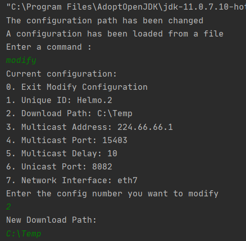
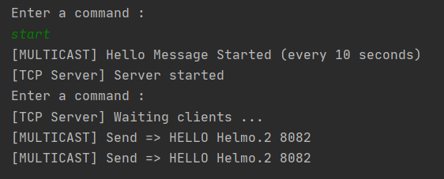
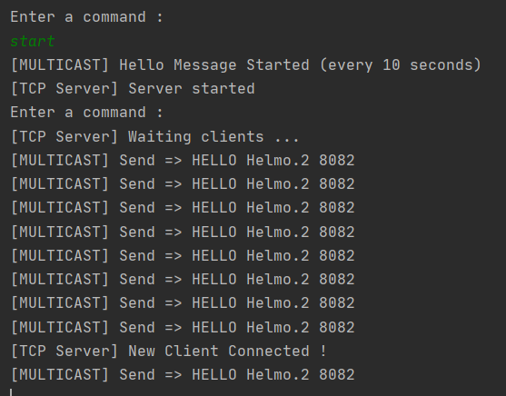
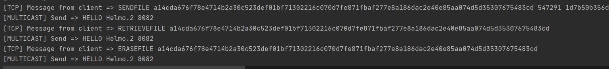

# secCon File Front End (Java)

## Installation

1. Le projet utilise maven, installez les dépendances en actualisant le fichier pom.xml
2. Lorsque vous lancez l'application pour la première fois, le fichier de configuration se trouvant dans le dossier ressources du projet va être chargé.
3. Pour pouvoir modifier la configuration du SBE tapez la commande : **modify**
4. Pour modifier l'interface réseau et le chemin vers le dossier de téléchargement, sélectionnez le chiffre correspondant (Voir illustrations)

5. Une fois que vous avez changé votre interface et votre dossier de téléchargement quittez le menu de configuration (0)
6. Entrez la commande **save** pour sauvegarder votre configuration dans le fichier json.
7. Pour démarrer le SBE entrez la commande **start**

## Démonstration

## Dépendances
- **gson**